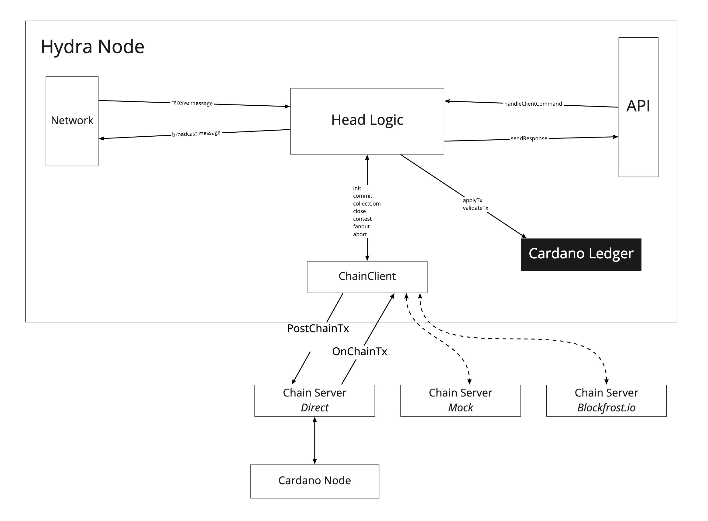

# 15. Chain Proxy as-a-Service

Date: 2022-02-23

## Status

:hammer_and_wrench:

## Context

* To be able to scale our benchmarks and test Hydra Heads with more realistic configurations, we resurrected our `MockChain` component. While this is not strictly needed as we could also have set up a cardano private network with each Hydra node having its own Cardano node, it seemed much simpler and still provide us with the information we need as we are interested in the performance of the Head network, not the On-Chain part
* This requires the ability to configure the `hydra-node` executable to use either a `MockChain` or `Direct` chain component to post and observe transactions, which means more command-line options and more code in the node
* There is a clear separation of responsibilities, defined as a [component](./0007-with-pattern-component-interfaces.md) `ChainComponent`, between the core `Node` logic and the `Chain`. The interaction is mediated by "messages" representing the relevant transitions of the Hydra Head state machine, for posting transaction to the chain and observing them. This interface is completely agnostic of the actual chain semantics and, as hinted in the [Hydra paper]() could very well be implemented in a lot of different ways, and over a lot of different blockchains.
* Different Hydra Head users could want to interact with the chain through different ways, whether it be [Blockfrost](https://blockfrost.io/), [Ogmios](https://ogmios.dev/), or a lightwallet, depending on their actual use cases, and this would require actually changing the Hydra node's code to implement a specific driver

## Decision

* The Hydra node _executable_ uses a `ChainComponent` that is implemented as a _generic client_ and configured using a single "port" (could be TCP or WS)
* This client interacts with whatever _server_ it connects sending and receiving `PostChainTx` and `OnChainTx` messages in full-duplex mode
* Specific _Chain servers_ can be provided as separate processes/services to be deployed and managed separately from the Hydra node. We provide 2 Chain server: One mock and one using direct connection to a cardano node

## Consequences

* Keeping the `ChainComponent` logic abstracted is important for testing purposes and ensuring proper separation of concerns
* Configuration (and code) of Hydra node is simplified
* Deployment and operations have more moving parts but are more flexible
* The lifecycle of the Hydra node and the Chain server can be completely separated, we might want to cope with timeouts/disconnections within the _chain client_ to insulate core node logic from the hiccups of the network but that's pretty standard practice in service-based architectures
* The state of the interaction between the Hydra node and the _Chain server_ is completely driven by the former, updated from whatever `OnChainTx` it retrieves

**NOTE**: The same principle could be applied for other components of the system, namely the `Network` and the `Ledger`. By making it possible and easy to run those as external services we decrease the footprint of the Hydra Node proper and increase its flexibility of use.
